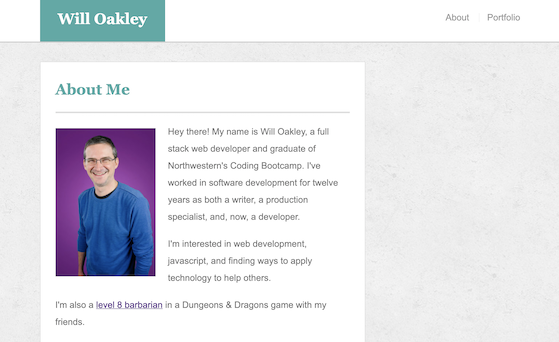
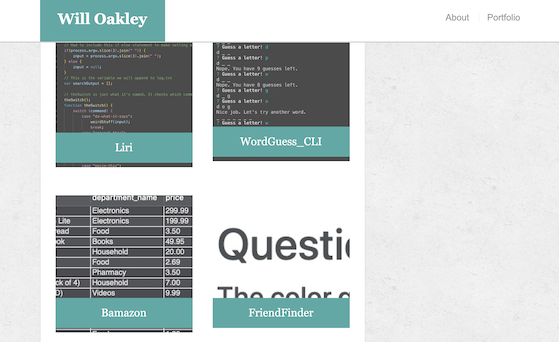
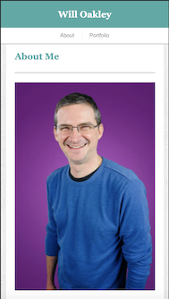
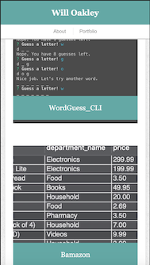

# Responsive-Portfolio

This is a portfolio of my work I created as an experiment in responsive css.

https://woaky1.github.io/Responsive-Portfolio/

**Note: I no longer update this portfolio. For my up-to-date portfolio, please visit https://woaky1.github.io/react-portfolio/.**

## Website Organization
The website is made up of two pages.

1. **The Landing Page:** The landing page features a quick bio of me, my contact information, as well as links to my GitHub profile and LinkedIn pages.

2. **The Portfolio Page:** This page offers a collection of projects I've worked on with links to those projects.

## Responsive Design
With both pages, the design of the change will alter depending on the size of the user's screen.

**The Landing Page as seen on an iPhone 8**

**The Portfolio Page as seen on an iPhone 8**

## Technology Used
The website only uses HTML and CSS.

## About Me
I'm a full stack web developer. Thanks for taking the time to check out this page.